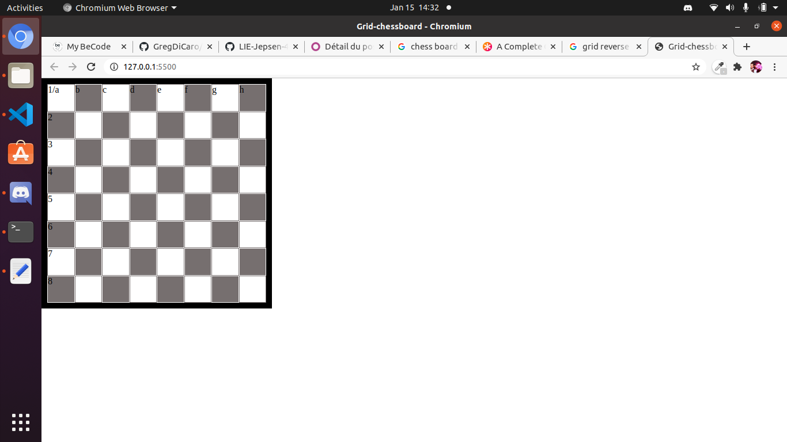

# grid-chessboard

https://gregdicaro.github.io/grid-chessboard/

Moi Greg j ai creer un projet pour la pratique de grid

c est une representation du jeu d'echec

j ai travaillé sur ce projet le 15 janvier jusque 14h30

j etais en teletravail donc chez moi

ca ressemble a un jeu d'echec classique

le projet est cours de réalisation

il a ete crée en hmtl css et j ai utilisé la techno grid

il est installe avec la propriete display:grid et son vocabulaire

ca vient d un exercice du coach Nico de chez becode
